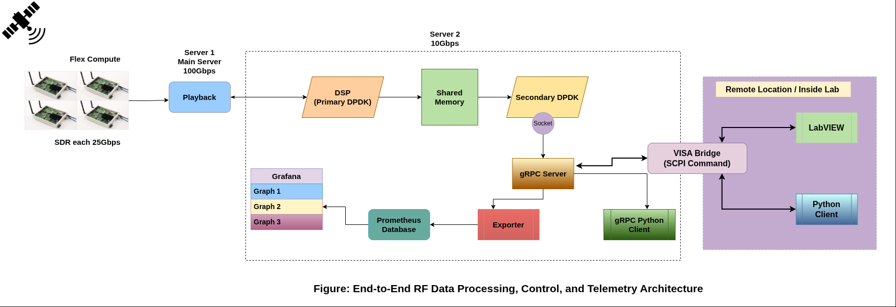
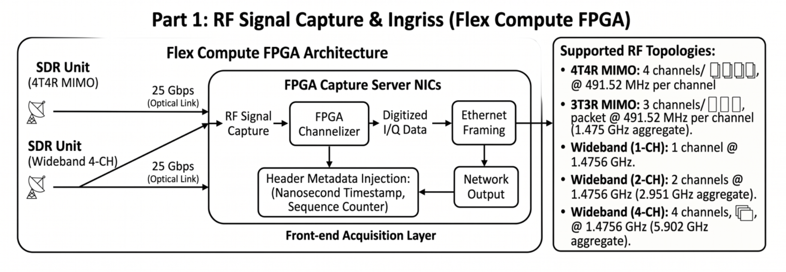
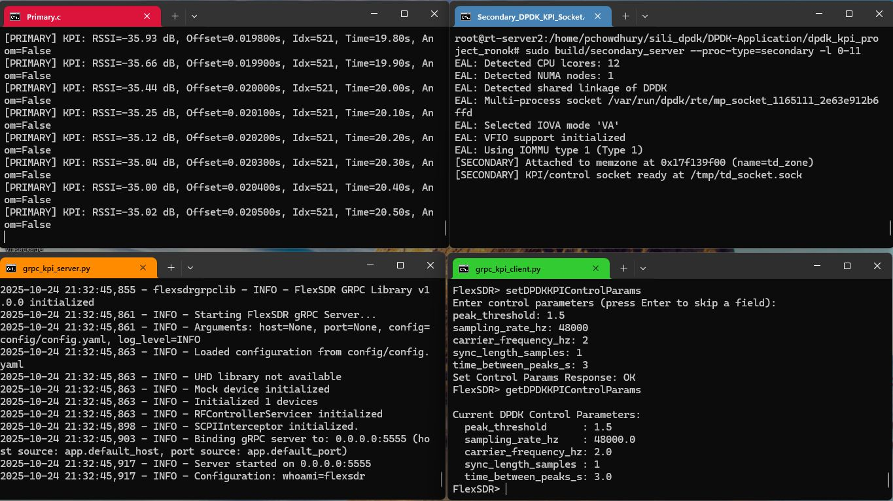
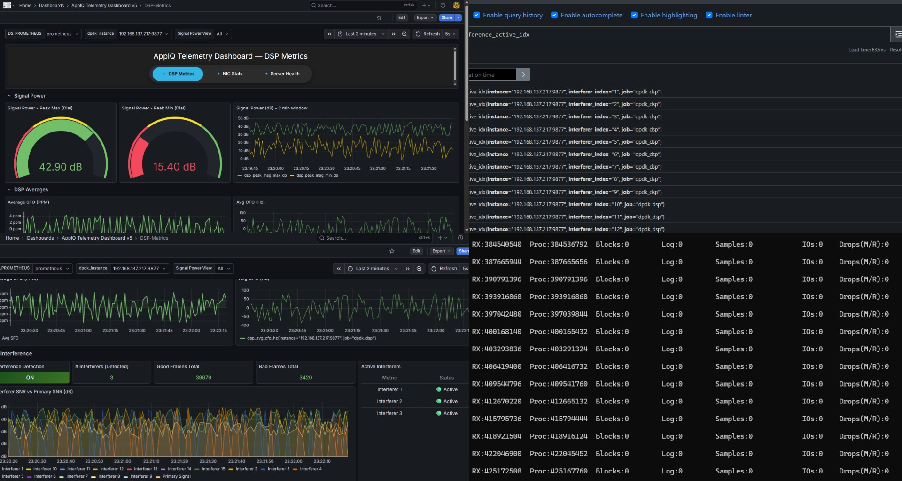
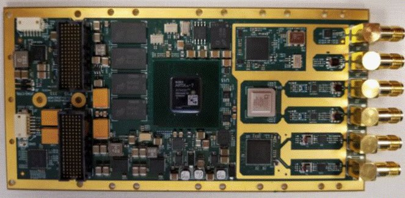

# Md. Shahariar Hassan Ronok

### Embedded Software Engineer | FPGA | SDR | High-Performance Systems | RTL/VLSI

  

I am an Embedded Software Engineer at [Siliconova Ltd.](https://siliconova.com/) working across embedded software, high-performance networking, FPGA-based systems, Software-Defined Radio, and hardware-software integration.

My engineering interests connect high-speed software systems with digital hardware, wireless communication, and computer architecture.

---

## Engineering Focus

`C` `C++` `Python` `Linux` `DPDK` `FPGA` `Verilog` `SDR` `RISC-V` `Cocotb` `gRPC`

---

## High-Performance RF and Embedded Systems

  

I work with high-throughput RF data acquisition, FPGA-to-host communication, DPDK data paths, remote control systems, telemetry, and performance validation.

<table>
  <tr>
    <td width="33%">
      
    </td>
    <td width="33%">
      
    </td>
    <td width="33%">
      
    </td>
  </tr>
  <tr>
    <td align="center"><strong>FPGA and RF Systems</strong></td>
    <td align="center"><strong>High-Speed Data Plane</strong></td>
    <td align="center"><strong>System Telemetry</strong></td>
  </tr>
</table>

---

## VLSI and Digital Hardware

  

My VLSI work focuses on RTL design, processor architecture, digital systems, and hardware verification.

Current work includes a 3-stage pipelined RISC-V processor and configurable FIFO and protocol FSM controllers using Verilog and Cocotb.

[View VLSI Projects](https://ronok-shahariar.github.io/vlsi-projects/)

---

## Research Interests

Wireless Communication  
Software-Defined Radio  
FPGA-Accelerated Systems  
Intelligent RF Systems  
Computer Architecture  
VLSI and Hardware-Software Co-Design

---

## Portfolio

[Research and Engineering Portfolio](https://ronok-shahariar.github.io/)

[Industrial Automation Portfolio](https://ronok-automation-portfolio-sm89.vercel.app/)

[Software Development Portfolio](https://porfolio-ronok.vercel.app/)

---

## Connect

[LinkedIn](https://www.linkedin.com/in/MD-Shahariar-Hasan-Ronok/)  
[GitHub](https://github.com/ronok-shahariar)  
[Email](mailto:346ronokarya@gmail.com)

---

  

  

